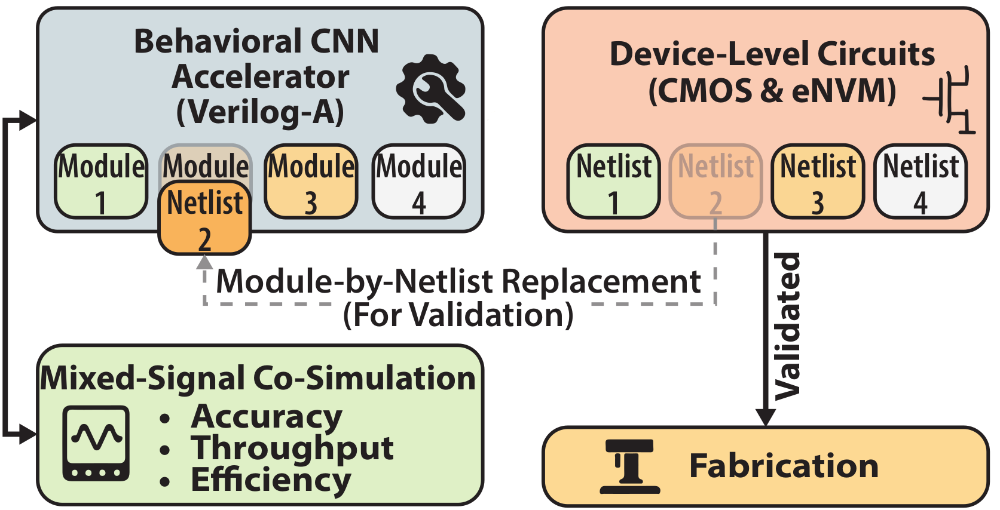
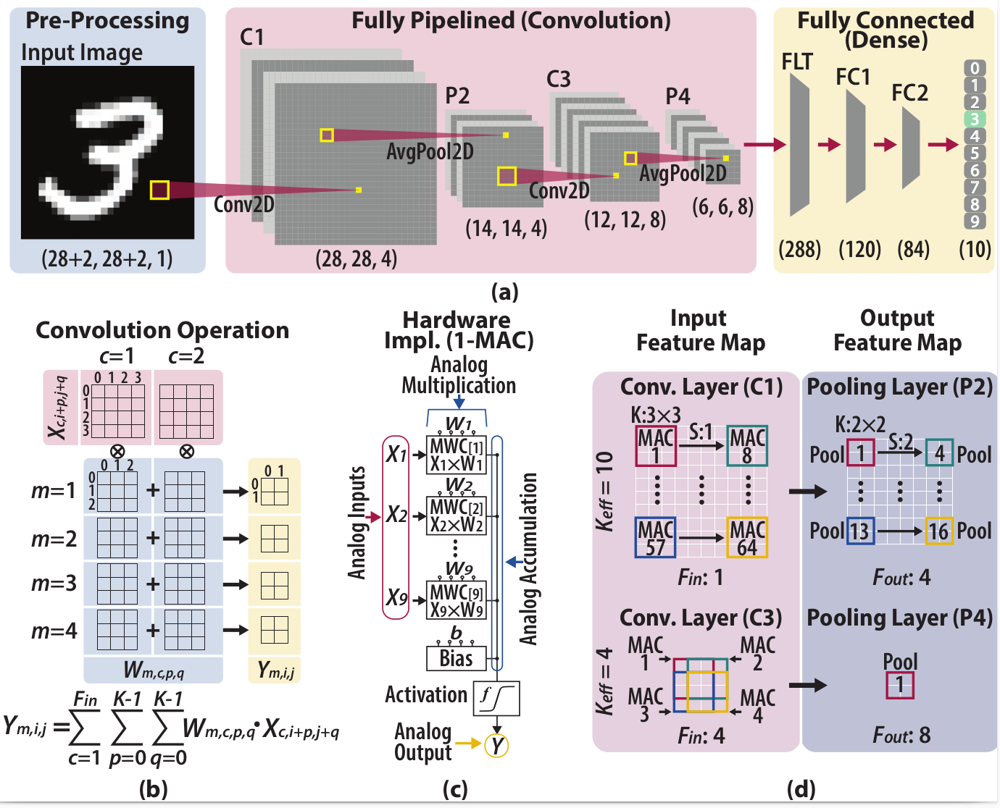

# mnist_veriloga

This repository contains the **Verilog-A implementation** and **Spectre testbenches** for simulating a **custom analog neural network model** designed for the **MNIST digit classification task**. The network includes analog implementations of convolutional, flattening, and fully connected layers, modeled in Verilog-A and tested in **Cadence Virtuoso** using **Spectre ADE Assembler/Maestro**.

  

---

## 📁 Repository Structure

mnist_veriloga/

├── library_models/

├── test_benches/

├── vector_files_for_sim/

├── outputs_maestro_csv/

├── assets/

└── README.md

### 1. `library_models/`
This folder contains five custom **Cadence Virtuoso libraries**, each implementing a layer of the neural network. These libraries must be **added to Virtuoso's Library Manager** to use the Verilog-A models in simulations.

**Included Libraries:**
- `PipeLine_CNN1_..._VAModel`: First convolutional layer
- `PipeLine_CNN2_..._VAModel`: Second convolutional layer
- `PipeLine_Flat_..._VAModel`: Flattening layer
- `PipeLine_FC1_..._VAModel`: First fully connected layer
- `PipeLine_FC2_..._VAModel`: Second fully connected layer

Each library implements Verilog-A models of analog hardware blocks such as:
- MAC units (Multiply-Accumulate)
- Bias addition circuits
- ReLU activation
- Pooling layers

> ⚙️ **To Add Libraries to Virtuoso:**
1. Open **Library Manager**
2. Go to **File > New > Library** or **Edit > Library Path**
3. Click **"Browse"**, then select the path to each folder under `library_models/`
4. Make sure they are accessible in your `cds.lib`

---

### 2. `test_benches/`

This is a Virtuoso library containing testbenches that simulate the behavior of the complete neural network model or individual blocks for debugging.

- 🔍 **Main Testbench**: `Test_pipeline`  
   This runs the **entire classification pipeline**, from input image to final class decision.
- 🛠️ **Other testbenches** (e.g., `Debug_CNN1`, `ADC_4bit_Test`, etc.) are included for module-level testing and debugging.

---

### 3. `vector_files_for_sim/`

This folder contains **Spectre-compatible vector files** for input image data, weights, and biases. These are critical for running the full model simulations.

- Vector files are formatted specifically for use in **ADE Assembler/Maestro**:
  - Add them in the simulation setup under **"Vector Files"**.
- Currently includes:
  - Weights and biases pre-trained to achieve ~96% accuracy
  - Two test images from MNIST dataset (classes **7** and **9**)

---

### 4. `outputs_maestro_csv/`

This folder contains a **CSV file** that can be imported into **ADE Maestro** to load **custom functions for plotting** outputs and intermediate values from the simulation.

> Alternatively, you may define these plotting functions manually inside ADE.

---

## 🧪 Running the Simulation

To simulate the full classification pipeline in Cadence Virtuoso:

1. **Add all libraries from `library_models/` to the Library Manager**
2. Open the `Test_pipeline` cell in the `test_benches/` library
3. Launch **ADE Assembler** or **Maestro**
4. Add vector files from `vector_files_for_sim/` in **Simulation Files → Vector Files**
5. Optionally import plotting functions from `outputs_maestro_csv/`
6. Run the simulation — output waveforms should reflect classification decision

---

## 🧠 Model Overview

This project implements a **fully analog pipeline architecture** for inference with a Convolutional Neural Network (CNN) trained on the **MNIST dataset**. Unlike traditional digital or mixed-signal accelerators, this architecture processes all layers — convolution, activation, pooling, and partial fully connected logic — using **purely analog signal flow**, minimizing the need for intermediate analog/digital conversions or analog storage.

  

### 🔧 Key Features

- **Pipelined analog CNN**: Continuous analog data processing through multiple CNN layers — two convolutional layers, a flattening stage, and two fully connected layers.
- **Verilog-A modeling**: All analog circuit blocks are behaviorally modeled using Verilog-A for use with Spectre in Cadence Virtuoso.
- **Modular layer libraries**: Each layer (e.g., Conv1, Conv2, FC1, FC2) is implemented as a separate Virtuoso library with functional analog components like:
  - Multiply-Accumulate (MAC) units  
  - Bias addition circuits  
  - ReLU activation  
  - Pooling (average/max)

### 📐 Model Architecture

The full model architecture follows the sequence:

Conv1 → Pool1 → Conv2 → Pool2 → Flatten → FC1 → FC2

- **Input**: Quantized MNIST images (30×30)
- **Intermediate computations**: All performed in the analog domain
- **Output**: Final prediction digit (0–9), digitized only after the last analog stage

### 🎯 Performance & Accuracy

- Designed to run using **hierarchical Verilog-A** to emulate realistic analog circuit behavior
- The current vector file setup achieves **~96% classification accuracy**
- Only two ADC conversions occur: one final digitization after the analog pipeline, minimizing energy and complexity

---

## 🗂️ File Cleanup Recommendations

If you've cloned this repo, it's safe to delete `.oa-`, `.oacache`, `.cdslck`, and other **temporary or cache** files. These are excluded via `.gitignore`.

---

## 📜 License

This project is licensed under the [MIT License](LICENSE).  
You are free to use, modify, and distribute this code with proper attribution.  
See the LICENSE file for details.

---

## 🤝 Contributions

Feel free to fork the repository and open pull requests for:
- Improved testbenches
- Additional plotting scripts
- Layer optimizations

For questions or suggestions, open an issue.

